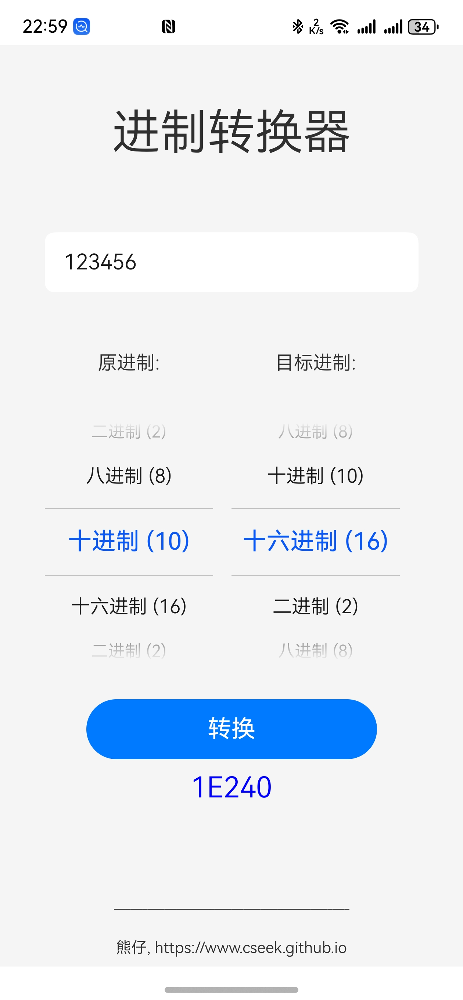

# HarmonyOS 进制转换器

一款轻量高效的进制转换工具，支持二进制、八进制、十进制、十六进制之间的快速互转，专为 HarmonyOS 生态打造。

## 功能特性 ✨

- **多进制支持**  
  支持2/8/10/16进制的数值输入与实时转换
- **智能纠错**  
  自动检测非法输入并提示（如二进制输入非0/1字符）

## 安装指南 📲

### 方式一：应用市场安装（尚未上架）
1. 前往华为应用市场搜索 **"进制转换器"**
2. 点击安装即可使用（当前版本：v1.0.0）

### 方式二：本地安装
1. 克隆代码到本地
2. 使用华为手机打开开发者模式
3. 使用 DecEco Studio 打开工程安装到手机

## 开发贡献 🤝
欢迎通过 Issue 提交建议或通过 Pull Request 参与改进：
1. `Fork` 本仓库
2. 创建特性分支 (`git checkout -b feature/your-feature`)
3. 提交修改 (`git commit -m 'Add some feature`')
4. 推送分支 (`git push origin feature/your-feature`)
5. 发起 `Pull Request`

## 许可证 ⚖️
本项目基于 [Apache License](http://www.apache.org/licenses) 开源，详情请见 `LICENSE` 文件。

## 联系作者 📧

如有问题或建议，请通过以下方式联系：
+ Email: jassimxiong@gmail.com
+ 技术博客: https://cseek.github.io